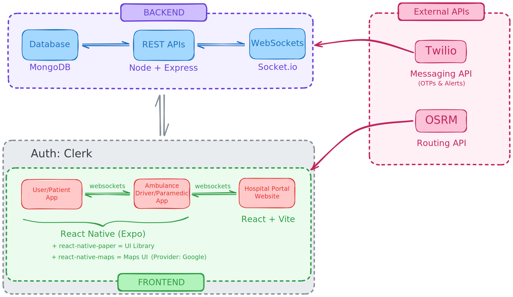
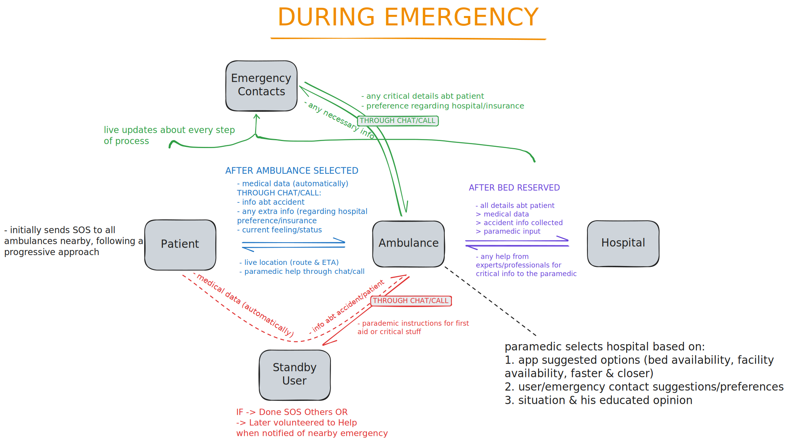

# ResQNet - Emergency Response System

A cross‑platform solution for rapid medical emergency response, comprising:

- **Patient App** (React Native + Expo)  
- **Paramedic App** (React Native + Expo)  
- **Hospital Portal** (React)

This project enables seamless SOS activation, ambulance dispatch, real‑time tracking, and hospital preparation.

---

## Table of Contents

1. [Features](#features)  
2. [Architecture Overview](#architecture-overview)  
3. [Tech Stack](#tech-stack)  
4. [Screenshots](#screenshots)   
5. [API Reference](#api-reference)  
6. [Folder Structure](#folder-structure)  
7. [Authors & Acknowledgments](#authors--acknowledgments)  

---

## Features

- **Patient App**  
  - Manual SOS (self & others) with 3‑second cancel timer  
  - Automatic SOS via accelerometer (“ARE YOU OKAY?” prompt)  
  - Real‑time ambulance tracking on map  
  - In‑app chat & voice call with paramedics  
  - Profile management & medical record uploads  

- **Paramedic App**  
  - SOS request queue with accept/decline  
  - Live navigation to patient (fastest‑route)  
  - On‑site triage & additional ambulance requests  
  - Pre‑pickup hospital selection based on bed availability  
  - In‑app communication with hospital staff  

- **Hospital Portal**  
  - Dashboard of incoming ambulances & incidents  
  - Pre‑arrival patient summary & bed reservation  
  - Real‑time communication with paramedics  
  - Hospital capacity monitoring & auto‑redirect  

---

## Architecture Overview


---

## Data Flow


---

## Tech Stack

- **Frontend**  
  - React Native & Expo
  - react-native-paper (UI)
  - React + Vite (Hospital Portal)  
- **Backend**  
  - Node.js + Express  
  - Socket.io (WebSockets)
- **Database**  
  - MongoDB Atlas 
- **Mapping & Navigation**  
  - react-native-maps (uses Google Maps provider)
  - OSRM (for routing)
- **Auth & Security**  
  - Clerk Auth
  - JSON Web Tokens (JWT)  
- **Messaging**  
  - Twilio  

---

## Screenshots

### Patient App
<p align="center">
  
  
  
  
  
  
  
  
</p>

### Paramedic App
<p align="center">
  
  
  
  
  
</p>

### Hospital Website
<p align="center">
  
  
  
  
</p>

---

## API Reference

### 👤 **User Management**

| Method | Endpoint                         | Description                            |
|--------|----------------------------------|----------------------------------------|
| POST   | `/api/user/create`               | Create new user using Clerk auth       |
| POST   | `/api/user/verify-phone`         | Send OTP to verify phone number        |
| POST   | `/api/user/verify-phone/check-otp` | Check OTP and verify user's phone     |
| GET    | `/api/user/profile`              | Get authenticated user's profile       |

---

### 🚑 **Ambulance Authentication**

| Method | Endpoint                 | Description               |
|--------|--------------------------|---------------------------|
| POST   | `/api/ambulance/register` | Register an ambulance     |
| POST   | `/api/ambulance/login`    | Login as an ambulance     |

---

### 🏥 **Hospital Authentication**

| Method | Endpoint                | Description              |
|--------|-------------------------|--------------------------|
| POST   | `/api/hospital/register` | Register a hospital      |
| POST   | `/api/hospital/login`    | Login as a hospital      |

---

### 🚨 **Emergency Requests**

| Method | Endpoint                                 | Description                                        |
|--------|------------------------------------------|----------------------------------------------------|
| POST   | `/api/request`                           | Create emergency request (authenticated user)      |
| PATCH  | `/api/accept/ambulance/:requestId`       | Ambulance accepts the request                      |
| PATCH  | `/api/accept/hospital/:requestId`        | Hospital accepts the request                       |
| POST   | `/api/check-assigned-ambulance`          | Check if ambulance is assigned (returns socketId)  |

---

### 📡 **Socket Events (via WebSocket server)**

| Event Name         | Payload                            | Description                                   |
|--------------------|-------------------------------------|-----------------------------------------------|
| `register`         | `{ id, role }`                      | Register socket ID for ambulance/hospital     |
| `status-update`    | `{ requestId, status, data }`       | Emit and update emergency status              |
| `disconnect`       | *None*                              | Handle socket disconnection                   |

---

## Folder Structure

```
/
├── backend/                  # APIs & WebSockets
├── frontend-user/            # User/Patient App
├── frontend-ambulance/       # Ambulance Driver/Paramedic App
├── frontend-hospital/        # Hospital Portal
└── docs/                     # Architecture diagrams, screenshots
```

---

## Authors & Acknowledgments

This project was originally developed by **Team Sudo Bang** for the hackathon **HackForge**, organized as part of **Srijan'25**, the annual techfest of **Jadavpur University**.

- 📅 **Date**: 6th April 2025  
- 📍 **Venue**: Jadavpur University Salt Lake Campus  
- 🧠 **Problem Statement**: *Enhancing Post-Accident Emergency Response in India*  
- 🚑 **Solution**: *Smart Emergency Response System*

**Team Sudo Bang**  
- **Pritam Das** – [LinkedIn](https://www.linkedin.com/in/pritamdas2006/) | Jadavpur University | Power Engineering '28
- **Sagnik Goswami** – [LinkedIn](https://www.linkedin.com/in/sagnikgos06/) | Jadavpur University | Power Engineering '28
- **Suparno Saha** – [LinkedIn](https://www.linkedin.com/in/letsbecool9792/) | Heritage Institute of Technology | CS & Business Studies '28
